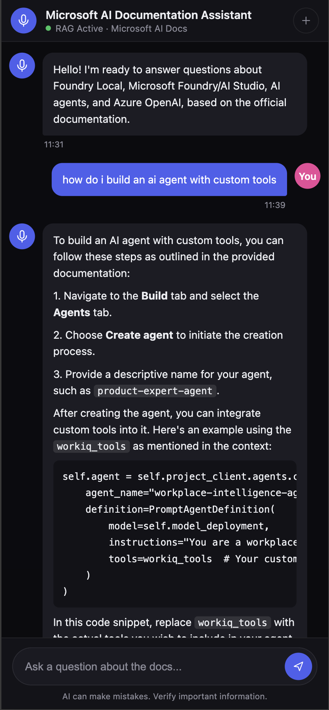
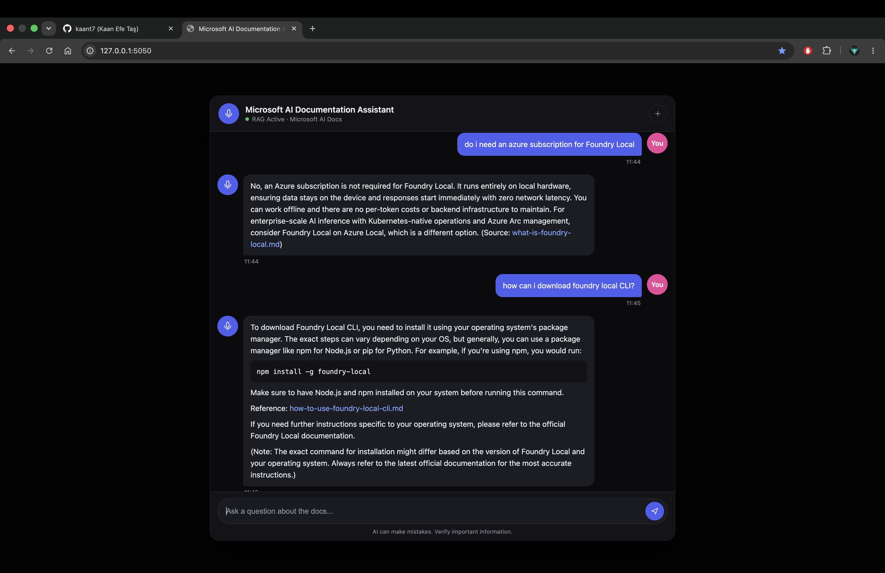

# Microsoft AI Documentation Assistant

A local, offline RAG (Retrieval-Augmented Generation) chatbot that answers questions about Microsoft's AI development tools — **Foundry Local**, **Microsoft Foundry / AI Studio**, **AI agents**, and **Azure OpenAI** — grounded strictly in official Microsoft Learn documentation and training content.

Everything runs on-device: embeddings, retrieval, and inference. No cloud API calls, no external database.

## Screenshots

| Mobile | Desktop |
|---|---|
|  |  |

## How it works

1. **Fetch** — `fetch_docs.py` pulls markdown content from official Microsoft Learn / MicrosoftLearning GitHub repos via sparse checkout (no full repo clones).
2. **Ingest** — `ingest.py` splits the markdown into semantic chunks (by heading), embeds each chunk with a local sentence-transformer model, and stores them in a SQLite database (`rag.db`).
3. **Chat** — a query is embedded, compared against every stored chunk with cosine similarity, and the top matches (above a relevance threshold) are injected as context into the system prompt sent to a local LLM served by [Foundry Local](https://github.com/microsoft/Foundry-Local).
4. If no chunk clears the relevance threshold, the app skips the LLM call entirely and returns a fixed "not covered" message — this avoids the model hallucinating answers to out-of-scope questions.

## Indexed content

| Folder | Source | Topics |
|---|---|---|
| `docs/foundry-local` | `MicrosoftDocs/azure-ai-docs` (`articles/foundry-local`) | Concepts, CLI/SDK/REST reference, how-tos, tutorials |
| `docs/ai-studio` | `MicrosoftLearning/mslearn-ai-studio` | AI Studio exploration, model catalog, fine-tuning, content filters |
| `docs/ai-agents` | `MicrosoftLearning/mslearn-ai-agents` | Building agents, custom tools, MCP integration, multi-agent workflows |
| `docs/openai` | `MicrosoftLearning/mslearn-openai` | Azure OpenAI app development, using your own data |

## Prerequisites

- Python 3.10+
- [Foundry Local](https://github.com/microsoft/Foundry-Local) installed and runnable (`foundry` CLI on your `PATH`)
  - macOS: `brew install microsoft/foundrylocal/foundrylocal`
- Git (used by `fetch_docs.py` for sparse checkout)

## Setup

```bash
python3 -m venv venv
source venv/bin/activate
pip install -r requirements.txt
```

Fetch the documentation and build the vector store:

```bash
python3 fetch_docs.py   # downloads docs into docs/
python3 ingest.py       # chunks, embeds, and writes rag.db
```

Re-run both any time you want to refresh the content.

## Running

**Command-line chat:**

```bash
python3 chat.py
```

**Web UI** (mobile- and desktop-responsive, served on `http://localhost:5050`):

```bash
python3 app.py
```

To reach the web UI from your phone, connect it to the same Wi-Fi network as this machine and open `http://<your-computer's-LAN-IP>:5050`.

## Project structure

```
config.py       Central settings (model name, chunking, retrieval, generation)
prompts.py      System prompt and the "not covered" fallback message
fetch_docs.py   Pulls markdown docs from GitHub sources into docs/
ingest.py       Chunks + embeds docs/ into rag.db
chat.py         CLI chat loop + shared retrieval/model-loading logic
app.py          Flask web server (serves static/ and the /chat API)
static/         Vanilla HTML/CSS/JS chat interface
docs/           Fetched Microsoft Learn content (regenerated by fetch_docs.py)
rag.db          SQLite vector store (regenerated by ingest.py)
```

## Configuration

Key settings live in `config.py`:

- `MODEL_NAME` — the Foundry Local model to use (default: `phi-3.5-mini`)
- `TOP_K` — how many chunks are retrieved per question
- `MIN_RELEVANCE_SCORE` — cosine similarity floor; questions with no chunk above this are answered with the fallback message instead of the LLM
- `MAX_TOKENS` / `TEMPERATURE` — generation length and randomness

To index additional Microsoft Learn products, add an entry to the `SOURCES` list in `fetch_docs.py` (repo URL + path to sparse-checkout), then re-run `fetch_docs.py` and `ingest.py`.

Internship Completion Video Link: https://www.youtube.com/watch?v=0sN_J0mMGHM
